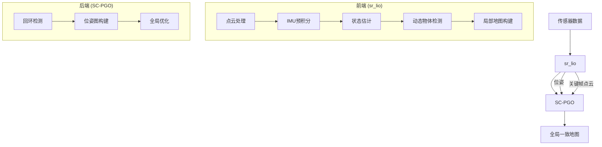
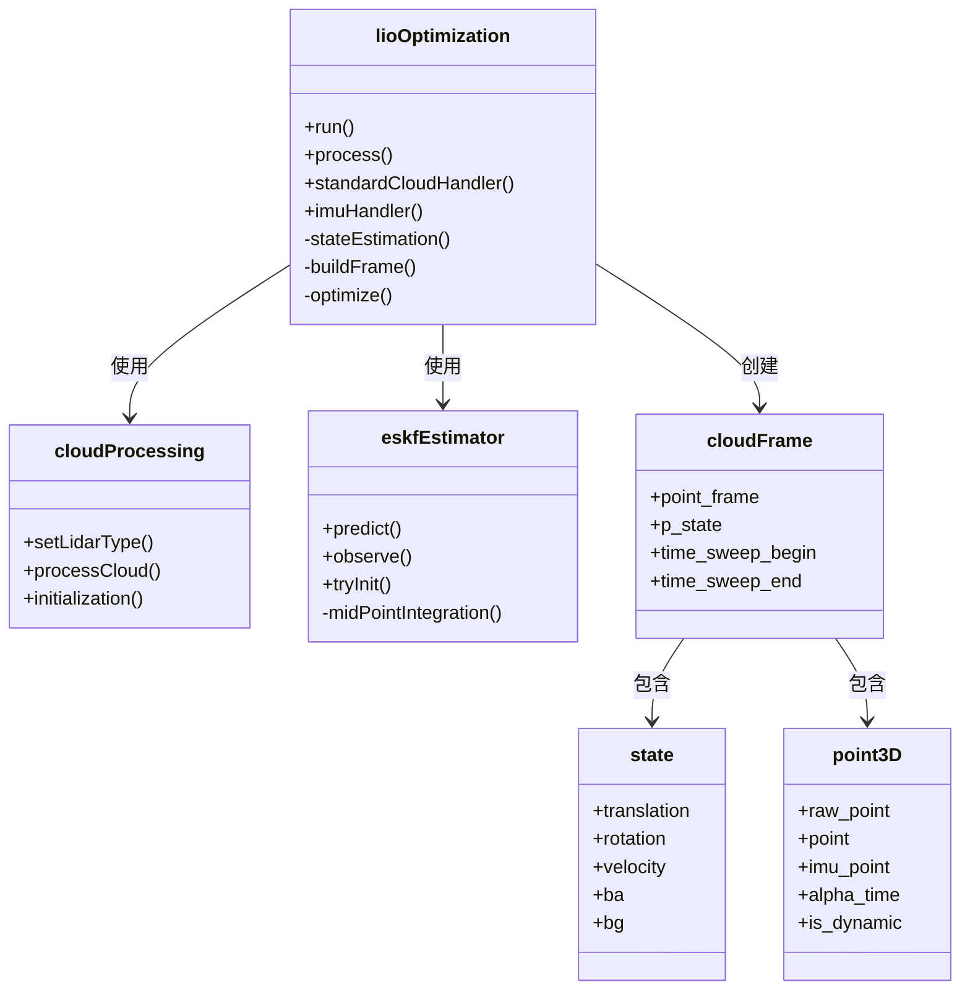
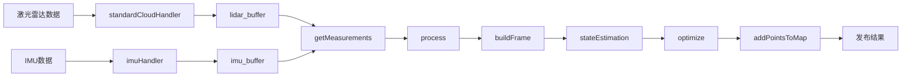
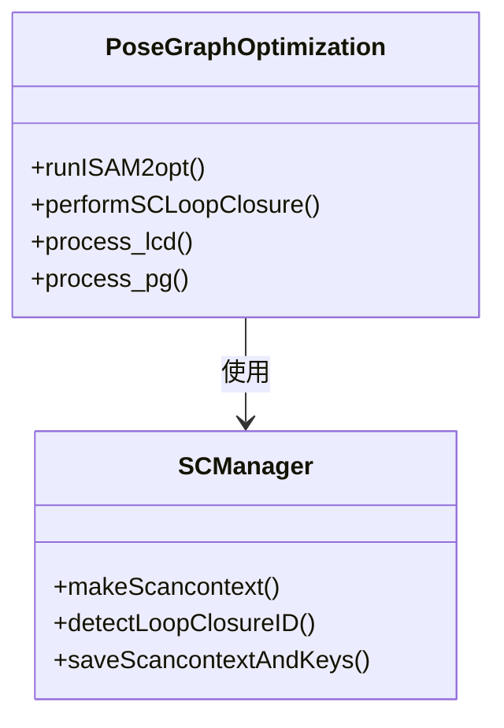
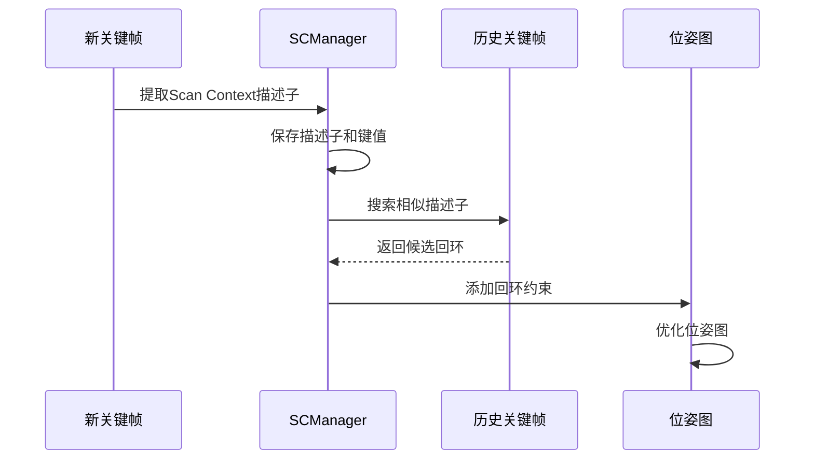
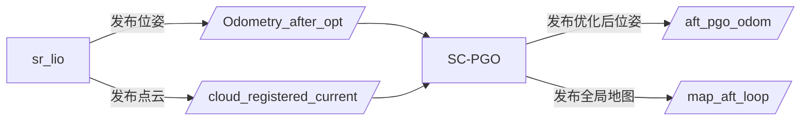
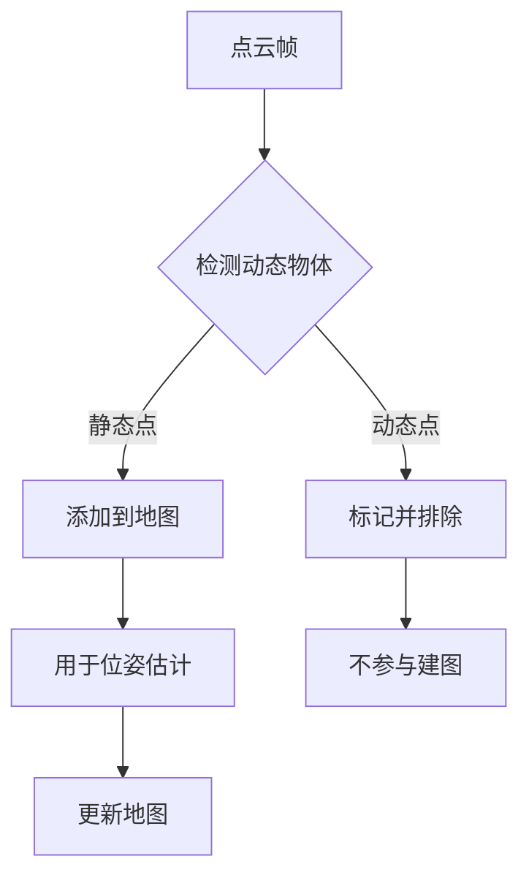

# Dynamic LiDAR-Inertial Odometry (Dynamic LIO) 项目结构

本文档提供了Dynamic LIO项目的代码结构概览，包括主要模块、类和它们之间的关系。

## 项目概述

Dynamic LIO是一个结合了激光雷达和IMU传感器的SLAM(同时定位与地图构建)系统，特别适用于动态环境。该项目包含两个主要模块：

1. **sr_lio**: State-Refusion Lidar-Inertial Odometry - 前端里程计系统
2. **SC-PGO**: Scan Context - Pose Graph Optimization - 后端优化系统

## 系统架构



## sr_lio模块结构

sr_lio是一个紧耦合的激光-惯性里程计系统，负责实时处理传感器数据并提供高精度的位姿估计。

### 核心类结构



### 主要文件及功能

- **lioOptimization.h/cpp**: 系统主框架，协调各组件工作
- **cloudProcessing.h/cpp**: 点云处理，特征提取
- **eskfEstimator.h/cpp**: 误差状态卡尔曼滤波器，IMU预积分
- **cloudMap.h/cpp**: 地图管理
- **state.h/cpp**: 状态表示与管理
- **utility.h/cpp**: 工具函数
- **parameters.h/cpp**: 参数管理

### 数据流



## SC-PGO模块结构

SC-PGO是基于Scan Context的位姿图优化系统，负责检测回环并优化全局位姿图。

### 核心类结构



### 主要文件及功能

- **laserPosegraphOptimization.cpp**: 位姿图构建与优化
- **Scancontext.h/cpp**: Scan Context回环检测算法
- **laserMapping.cpp**: 地图构建
- **laserOdometry.cpp**: 激光里程计
- **scanRegistration.cpp**: 点云预处理

### 回环检测流程



## 系统集成

两个模块通过ROS话题进行通信，sr_lio发布位姿和点云数据，SC-PGO订阅这些数据并进行后端处理。



## 动态物体处理

系统具有检测和处理动态物体的能力，主要流程如下：



## 参数配置

系统的主要参数通过YAML配置文件设置，包括：

- 传感器参数（激光雷达类型、IMU噪声等）
- 算法参数（体素大小、ICP迭代次数等）
- 系统参数（话题名称、输出路径等）

## 启动系统

使用提供的启动脚本运行系统：

```bash
./dynamic_lio_CA_startup.sh
```

或通过ROS launch文件启动：

```bash
roslaunch sr_lio lio_ulhk_CA.launch
roslaunch SC-PGO loop_closure.launch
``` 